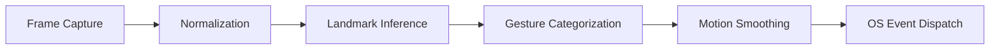

# Technical Whitepaper: HandFluxAI Architecture

## Executive Summary
HandFluxAI is a high-performance computer vision framework engineered for real-time human-computer interaction (HCI). This document details the technical infrastructure, data processing pipelines, and modular design patterns that ensure the system's scalability and reliability.

---

## 🏗️ System Design Principles

The HandFluxAI engine is founded on three pillars of software excellence:
1.  **Decoupled Modularity**: Isolated components for perception, cognition, and execution ensure maintainability and ease of integration into existing enterprise stacks.
2.  **Telemetry-Driven Execution**: Real-time logging and performance monitoring (FPS/Intent tracking) provide operational transparency.
3.  **Cross-Platform Consistency**: Utilizing standardized libraries (OpenCV, MediaPipe) ensures a uniform experience across Windows, macOS, and Linux environments.

---

## 🧩 Architectural Components

### 1. Perception Engine (`src/hand_tracker.py`)
Utilizing the **MediaPipe Tasks API**, this layer performs high-frequency inference to identify 21 localized 3D landmarks.
*   **Backbone**: TensorFlow Lite models optimized for edge device performance.
*   **Automatic Asset Management**: Intelligent bootstrapping of the `hand_landmarker.task` prevents deployment friction.

### 2. Cognitive Interpretation (`src/gesture_recognizer.py`)
A heuristic analysis engine that transforms raw coordinate vectors into semantic system intents.
*   **Logic Model**: Real-time state-vector comparison and Euclidean distance thresholding.
*   **Intent Mapping**: Decouples physical hand configurations from system actions, allowing for customizable user profiles.

### 3. Execution Controller (`src/action_controller.py`)
Responsible for the final translation of intents into kernel-level OS events.
*   **Jitter Reduction**: Implements a multi-stage **Moving Average Filter** to provide smooth, professional cursor travel.
*   **Interpolation Layer**: Dynamically maps normalized perception coordinates to hardware-specific screen resolutions.

---

## 📈 Data Pipeline Flow

## 🔐 Compliance & Stability
*   **Fail-Safe Mechanisms**: Integrated PyAutoGUI fail-safes prevent uncontrollable system states.
*   **Resource Efficiency**: Designed for minimal CPU/GPU overhead, allowing for background operation during parallel high-performance tasks.
*   **Extensibility**: The system architecture supports the injection of custom gesture-to-action mappings via the standard `config.json` interface.

---
© 2026 HandFluxAI Enterprise Operations
