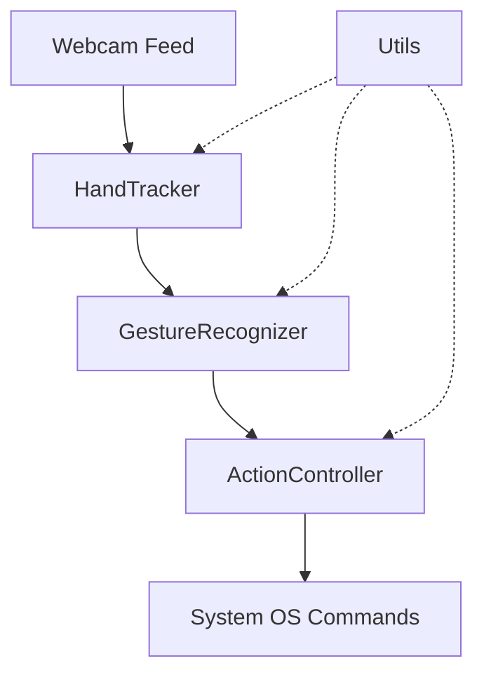

# System Architecture - HandFluxAI

This document outlines the design and data flow of the HandFluxAI gesture control system.

## Overview

HandFluxAI is built on a decoupled architecture composed of four primary modules: **Tracking**, **Recognition**, **Action**, and **Utilities**.

## Module Responsibilities

### 1. HandTracker (`src/hand_tracker.py`)
- Interfaces with the MediaPipe Hands solution.
- Processes individual video frames to detect hand landmarks.
- Returns a normalized list of 21 keypoints representing hand joints.
- Provides utility to check which fingers are extended.

### 2. GestureRecognizer (`src/gesture_recognizer.py`)
- Consumes landmark lists and finger states.
- Applies geometric logic (distance, relative position) to identify high-level gestures.
- Decouples raw tracking data from semantic meaning (e.g., converting "Index Up" landmark state to "MOVE" intent).

### 3. ActionController (`src/action_controller.py`)
- Maps recognized gestures to physical system actions using PyAutoGUI.
- Implements **Motion Smoothing** via moving averages to prevent cursor jitter.
- Handles screen mapping (scaling camera coordinates to display resolution).
- Manages cooldowns and state transitions to prevent repeated triggers (e.g., double clicks).

### 4. Utils (`src/utils.py`)
- Independent mathematical helpers.
- `calculate_distance`: Vector-based Euclidean distance.
- `MovingAverage`: Queue-based smoothing buffer.
- `map_value`: Linear interpolation for coordinate mapping.

## Data Flow

1. **Capture**: A frame is read from the OpenCV `VideoCapture`.
2. **Detection**: `HandTracker` detects landarks.
3. **Logic**: `GestureRecognizer` checks landmark patterns against gesture definitions.
4. **Transform**: `ActionController` receives a gesture (e.g., "MOVE") and specific landmark data (Index Tip).
5. **Smoothing**: Coordinates are passed through a buffer to ensure smooth cursor travel.
6. **Execution**: System call is made (e.g., `pyautogui.moveTo`).
7. **Loop**: The cycle repeats at ~30-60 FPS depending on hardware.

## Design Patterns

- **Separation of Concerns**: Each module has a specific, isolated responsibility.
- **Dependency Injection**: The `main.py` entry point initializes and passes configuration to each component.
- **Buffer/Filter Pattern**: Used for jitter reduction in cursor movement.
